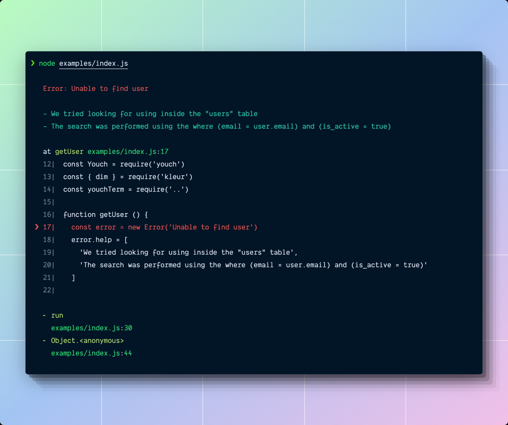

# Youch terminal



This package converts the [youch](https://npmjs.com/package/youch) error message to a string to be displayed on terminal. The output of the function is colorized using [chalk](https://npmjs.com/package/chalk).

## Install
```
npm i youch-terminal
```

## Usage
Make sure you pass the output `toJSON` to the youch terminal function.

```js
const Youch = require('youch')
const forTerminal = require('youch-terminal')

const error = new Error('Some weird error')
const jsonResponse = await new Youch(error, {}).toJSON()

const options = {
  // Defaults to false
  displayShortPath: false,

  // Defaults to single whitspace
  prefix: ' ',

  // Defaults to false
  hideErrorTitle: false,

  // Defaults to false
  hideMessage: false,

  // Defaults to false
  displayMainFrameOnly: false,

  // Defaults to 3
  framesMaxLimit: 3,
}

console.log(forTerminal(output, options))
```
